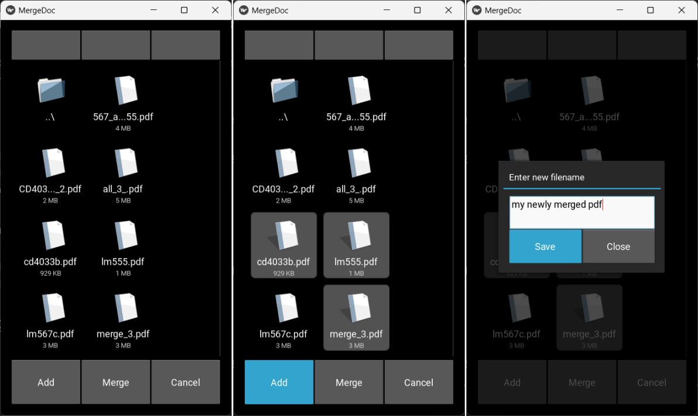

# PDF Merger Application

This application allows you to merge multiple PDF files located in the same directory. Built using PyPDF and Kivy.

## Features:
- Merge multiple PDFs
- Multiple selection
- Cancel selections

## Dependencies
- Kivy==2.3.0
- PyPDF==4.2.0

## Usage
1. Place the PDF files you want to merge in the same directory.
2. Run the application.
3. Navigate to the file directory.
4. Select the PDF files in the desired order.
5. Merge the files.
6. Refresh the file directory to view the merged PDF